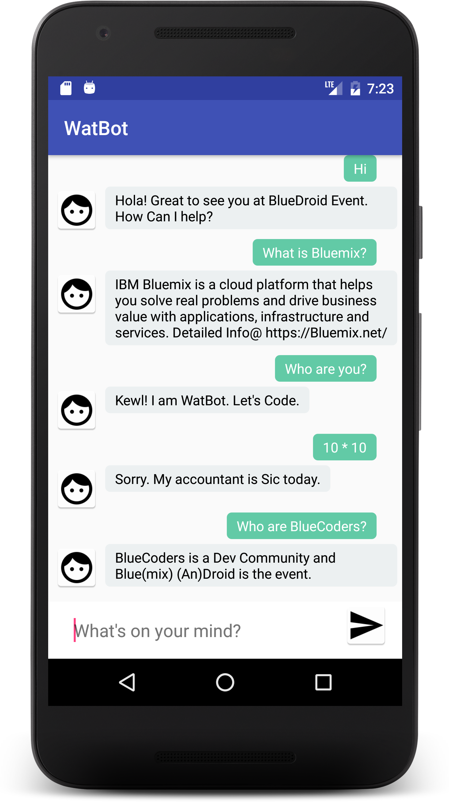

# WatBot - An Android ChatBot powered by IBM Watson


WatBot is an IBM Watson powered ChatBot running on and using Conversation Service on IBM (an open standards, cloud platform for building, running, and managing apps and services).
<p align="center"></p>


<h2>Coding the app on Android Studio</h2>
Android Studio is the Official IDE for Android. Android Studio provides the fastest tools for building apps on every type of Android device.

Clone the [repo](https://github.com/Vivekpanchal/watbot) and import the code in Android Studio,

```
git clone https://github.com/Vivekpanchal/watbot.git
```


### Don't stop here!!! Keep coding and using Bluemix
